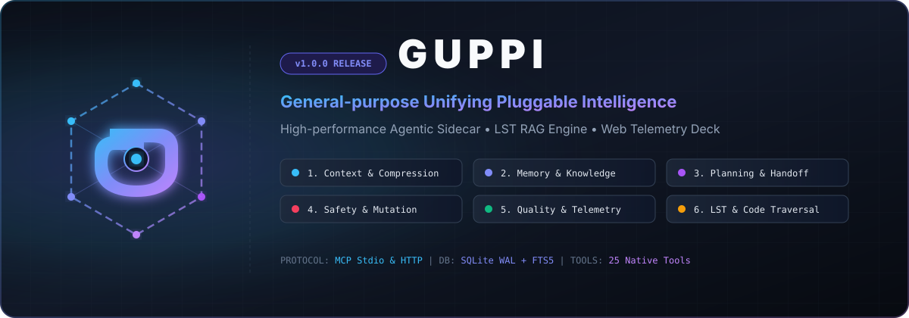

<p align="center">
  
</p>

<p align="center">
  <strong>The high-performance agentic sidecar, LST memory engine, & telemetry control deck built for real AI workflows.</strong>
</p>

<p align="center">
  <a href="https://nodejs.org"></a>
  <a href="https://www.typescriptlang.org"></a>
  <a href="https://modelcontextprotocol.io"></a>
  <a href="https://sqlite.org"></a>
  <a href="LICENSE"></a>
  
</p>

---

## 🌟 Overview

**GUPPI** (*General-purpose Unifying Pluggable Intelligence*) is an enterprise-grade, plug-and-play agentic sidecar daemon, RAG memory engine, and real-time telemetry deck. GUPPI hooks directly into development workspaces alongside primary AI coding tools (**Antigravity CLI**, **Claude Code**, **Cursor**, **Windsurf**, **Pi**, **AutoGen**, **CrewAI**, **Aider**).

Rather than replacing your existing AI agentic workflows, GUPPI acts as an **"intelligent second brain"** operating in the background:
- ⚡ **Programmatically indexes AST symbols** & Lossless Semantic Trees (LST) for instant token-compressed code navigation (~70-80% token savings).
- 🧠 **Maintains long-term decay-ranked RAG memory** and extracts subject-relation-object Fact Graphs across agent sessions.
- 📋 **Orchestrates multi-agent DAG task plans** with structured session handoff checkpoints.
- 🛡️ **Enforces pre-flight safety guardrails**, secret detection, and non-destructive shadow file backups before code mutations.
- 🧪 **Benchmarks agent precision, faithfulness & latency** (DeepEval/AgentOps style) with auto-generated AST unit test suites.
- 🎛️ **Serves a glassmorphic Web Control Deck** at `http://localhost:3737`.

---

## ✨ 6 Core Functional Pillars

GUPPI organizes its capabilities into 6 condensed functional pillars:

| Pillar Module | Core Purpose | Key Tools & Engines |
| :--- | :--- | :--- |
| 📦 **1. Context & Compression** | Traverses workspace files, parses AST signatures, extracts rules (`AGENTS.md`, `CLAUDE.md`), and compresses prompt context. | `guppi_onboard`, `guppi_skeletonize`, `guppi_inspect_symbol`, `guppi_git_rag` |
| 🧠 **2. Memory & Knowledge Graph** | Hybrid BM25/FTS5 text search, Ebbinghaus decay-ranked episodic memory, and subject-relation-object Fact Graph extraction. | `guppi_remember`, `guppi_episodic_remember`, `guppi_query_facts`, `guppi_working_memory` |
| 📋 **3. Multi-Agent Planning & Handoff** | Decomposes complex goals into multi-agent DAG task plans and manages subagent context handoff checkpoints. | `guppi_task_plan_create`, `guppi_task_step_update`, `guppi_compact_session`, `guppi_subagent_checkpoint` |
| 🛡️ **4. Safety, Mutation & Self-Healing** | Pre-flight safety audit, secret detection, shadow backup snapshot creation, symbol call graph mutation simulation, and traceback auto-fix. | `guppi_guard_check`, `guppi_guard_enforce`, `guppi_rollback_file`, `guppi_signature_mutate_simulate` |
| 🧪 **5. Quality & Telemetry** | Agent RAG precision benchmarking (DeepEval/AgentOps), automated unit test generation, and interactive Q&A spec brainstorming. | `guppi_evaluate_run`, `guppi_log_telemetry`, `guppi_brainstorm_start`, `guppi_generate_tests` |
| 🌳 **6. LST & Codebase Traversal** | Serena-style scope-aware symbol search, Lossless Semantic Tree (LST) structural querying, cross-file reference tracing, and atomic code body replacement. | `guppi_lst_find_symbols`, `guppi_lst_query_tree`, `guppi_lst_find_references`, `guppi_lst_replace_symbol` |

---

## ⚡ Quick Start CLI Guide

```bash
# 1. Install dependencies & build GUPPI
npm install
npm run build
npm link

# 2. Initialize GUPPI in your project (creates .guppi/guppi.db and .guppi/mcp.json)
guppi init

# 3. Start the background daemon & Web Control Deck
guppi start

# 4. Serena-Style Symbol Search (LST Engine)
guppi symbol LSTTraversalEngine

# 5. Query Lossless Semantic Tree (LST) Structure
guppi tree src/engine/lst_traversal.ts ClassDeclaration

# 6. Find Cross-File Call References
guppi refs GuppiDB

# 7. Query Hybrid RAG Memory
guppi query "SQLite WAL mode"

# 8. Record an Architectural Decision
guppi remember "Use SQLite WAL" "SQLite WAL mode enables sub-millisecond concurrent reads/writes."

# 9. Decompose Goal into a Multi-Agent DAG Task Plan
guppi plan "Build OAuth2 authentication engine"

# 10. Run AST Call Graph & Signature Mutation Simulator
guppi callgraph GuppiDB

# 11. Run stdio MCP server for agent pipes
guppi mcp
```

---

## 🔌 Agentic Integration (Model Context Protocol - MCP)

Add this configuration snippet to your primary agent's settings (e.g., `mcp_config.json` or `.guppi/mcp.json`):

```json
{
  "mcpServers": {
    "guppi": {
      "command": "guppi",
      "args": ["mcp"],
      "env": {
        "GUPPI_WORKSPACE": "/path/to/your/project"
      }
    }
  }
}
```

> 📖 **Full Agentic Integration Guide**: See [`docs/AGENT_WORKFLOW_GUIDE.md`](file:///Users/ashton/git/something/docs/AGENT_WORKFLOW_GUIDE.md) for detailed instructions on instrumenting GUPPI within CLI agents, custom scripts, and system prompts.

---

## 🛠️ Complete MCP Tools Reference (25 Tools)

### 📦 Pillar 1: Context & Compression
- `guppi_onboard`: Programmatically scan workspace & re-index AST symbols.
- `guppi_query_context`: Hybrid RAG search over memories, rules, and symbols.
- `guppi_skeletonize`: Generate token-compressed AST code skeleton (~70-80% token savings).
- `guppi_inspect_symbol`: Query function/class AST signatures without opening full files.
- `guppi_git_rag`: Query Git commit history & diff database.

### 🧠 Pillar 2: Memory & Knowledge Graph
- `guppi_remember`: Save long-term architectural decisions and rules.
- `guppi_episodic_remember`: Store decay-ranked episodic memory & extract Fact Triples.
- `guppi_query_facts`: Query extracted subject-relation-object Fact Graph triples.
- `guppi_working_memory`: Read/write ephemeral working memory scratchpad.
- `guppi_link_knowledge`: Create Knowledge Graph edge (`memory_id` $\rightarrow$ `target_symbol_or_file`).

### 📋 Pillar 3: Multi-Agent Planning & Handoff
- `guppi_task_plan_create`: Decompose goal into multi-agent DAG task plan.
- `guppi_task_step_update`: Update step status in DAG orchestrator.
- `guppi_compact_session`: Save structured Handoff Checkpoint to Working Memory.
- `guppi_subagent_checkpoint`: Manage subagent checkpoints and context handoffs.

### 🛡️ Pillar 4: Safety, Mutation & Self-Healing
- `guppi_guard_check`: Run pre-flight safety & secret detection checks.
- `guppi_guard_enforce`: Run safety audit & create non-destructive shadow backup snapshot.
- `guppi_rollback_file`: Roll back a file to its latest shadow backup snapshot.
- `guppi_self_heal`: Analyze error traceback and receive surgical auto-repair diff.
- `guppi_auto_fix_suggest`: Parse error logs and receive auto-repair patch recommendation.
- `guppi_impact_analysis`: Evaluate downstream breaking changes across callers and files.
- `guppi_signature_mutate_simulate`: Simulate signature mutation & evaluate breaking change risk.

### 🧪 Pillar 5: Quality & Telemetry
- `guppi_evaluate_run`: Benchmark agent precision, faithfulness, latency, and token cost.
- `guppi_log_telemetry`: Log tool call traces, latencies, and token counts.
- `guppi_generate_tests`: Auto-generate unit test suites from AST signatures.
- `guppi_brainstorm_start`: Start interactive Q&A brainstorming session (Starbursting, SCAMPER, 5-Whys).
- `guppi_brainstorm_answer`: Submit answer & advance phase or synthesize spec blueprint.

### 🌳 Pillar 6: LST & Codebase Traversal
- `guppi_lst_find_symbols`: Scope-aware and fuzzy symbol lookup enriched with memories and Fact Triples.
- `guppi_lst_query_tree`: Query Lossless Semantic Tree (LST) nodes using structural path selectors.
- `guppi_lst_find_references`: Locate all caller sites, instantiations, type usages, and imports across workspace.
- `guppi_lst_skeleton_slice`: Generate token-efficient folded code slice collapsing implementation bodies.
- `guppi_lst_replace_symbol`: Replace target symbol body losslessly while preserving formatting, with automatic shadow backup.

---

## 🗂️ Virtual Context Filesystem (`guppi://`)

GUPPI exposes standard MCP Resources that agents can browse or read:

| Resource URI | Description | MIME Type |
| :--- | :--- | :--- |
| `guppi://memories/all` | All stored workspace architectural decisions & rules. | `application/json` |
| `guppi://symbols/all` | Complete codebase AST symbol map. | `application/json` |
| `guppi://lst/symbols/all` | Lossless Semantic Symbols index enriched with memory links. | `application/json` |
| `guppi://recipes/codebase_traversal` | LST Traversal & symbol navigation decision matrix. | `application/json` |
| `guppi://recipes/tool_selection` | Agentic Tool Selection recipes matrix. | `application/json` |
| `guppi://git/history` | Git commit log & diff summaries. | `application/json` |
| `guppi://brainstorm/blueprint` | Latest synthesized Brainstorm Spec Blueprint markdown. | `text/markdown` |
| `guppi://tasks/active` | Active task execution plans and DAG step progress. | `application/json` |
| `guppi://facts/graph` | Extracted subject-relation-object Fact Graph triples. | `application/json` |
| `guppi://eval/reports` | Agent RAG precision, faithfulness & latency reports. | `application/json` |
| `guppi://graph/callgraph` | AST symbol call graph nodes and hierarchy edges. | `application/json` |
| `guppi://checkpoints/active` | Subagent session handoff checkpoints. | `application/json` |
| `guppi://backups/recent` | Active shadow file backup snapshots. | `application/json` |
| `guppi://guardrails/rules` | Active safety guardrails & secret patterns. | `application/json` |

---

## 🏗️ Project Architecture Layout

```
/guppi
├── assets/
│   ├── logo.svg                  # Vector SVG brand emblem
│   └── banner.svg                # Header hero banner SVG
├── bin/
│   └── guppi.js                  # Executable CLI entrypoint
├── docs/
│   └── AGENT_WORKFLOW_GUIDE.md   # Complete Agentic Instrumentation & Workflow Guide
├── src/
│   ├── cli/
│   │   └── main.ts               # Commander CLI definition & commands
│   ├── server/
│   │   ├── index.ts              # Server daemon manager
│   │   ├── mcp.ts                # MCP Server (Stdio & HTTP transport)
│   │   └── pillars/              # 6 Condensed Functional Pillar Modules
│   │       ├── context_pillar.ts # Pillar 1: Context & Compression
│   │       ├── memory_pillar.ts  # Pillar 2: Memory & Knowledge Graph
│   │       ├── planning_pillar.ts # Pillar 3: Multi-Agent Planning & Handoff
│   │       ├── safety_pillar.ts  # Pillar 4: Safety & Mutation
│   │       ├── quality_pillar.ts # Pillar 5: Quality & Telemetry
│   │       └── lst_pillar.ts     # Pillar 6: LST & Codebase Traversal
│   ├── db/
│   │   ├── schema.ts             # SQLite WAL schema & FTS5 virtual tables
│   │   └── client.ts             # GuppiDB client & query helpers
│   ├── engine/
│   │   ├── lst_traversal.ts      # Serena-style LST Engine & Reference Tracer
│   │   ├── task_planner.ts       # Task DAG Orchestrator (Aider/Superpowers)
│   │   ├── episodic_memory.ts    # Decay-Ranked Memory & Fact Graph (Mem0/MemGPT)
│   │   ├── agent_eval.ts         # RAG Precision Benchmark Studio (DeepEval/AgentOps)
│   │   ├── symbol_call_graph.ts  # Call Graph & Mutation Simulator (Tree-Sitter/GraphRAG)
│   │   ├── guard_enforcer.ts     # Shadow backup & rollback engine
│   │   ├── onboarder.ts          # Codebase & rule traversal engine
│   │   └── brainstorm.ts         # Interactive Q&A ideation engine
│   └── dashboard/                # React + Vite Glassmorphic Dashboard UI
├── test/
│   ├── agentic_assist.spec.ts    # Agentic assistance engine tests
│   └── poached_features.spec.ts  # Poached feature pillar tests
└── CHANGELOG.md                  # Release changelog
```

---

## 🛡️ Privacy & Security Guarantees

1. **100% Local & Offline**: All databases (`guppi.db`), RAG indexes, and backups remain strictly on your local machine. No code or context is sent to external cloud servers.
2. **Non-Destructive Shadow Backups**: GUPPI automatically creates timestamped backup snapshots in `.guppi/backups/` before applying any atomic code replacement.
3. **Pre-flight Secret Guardrails**: Pre-flight audits flag hardcoded API keys, credentials, or empty exception catch blocks before edits are saved.

---

## 📄 License

MIT © GUPPI Development Team
